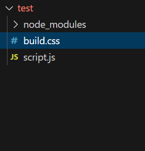
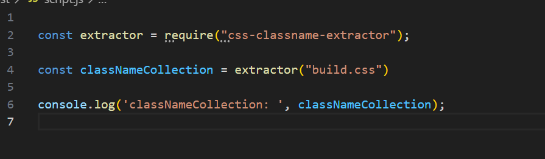

# css-classnames-extractor

Follow the below steps to extract ClassNames alone from your css file :

## 1) Place your .css file at the root of your project.

In the above case path="build.cs"

if the css file is placed within a folder :

path="folder/build.css"

## 2) Install the below command : npm i css-classname-extractor

## 3) Import and pass the relative path of your css file with respect to root of your folder, to the imported method from npm.

Happy coding ! :')
